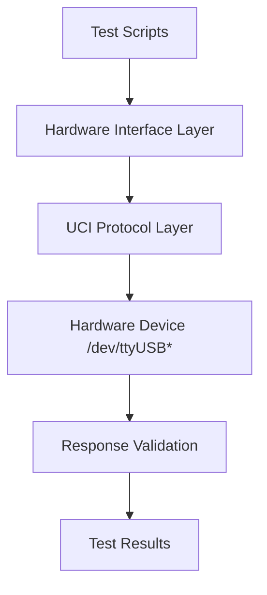

# UCI Interactive Shell - Hardware Testing Preparation

## Executive Summary

This document outlines the preparation for hardware testing of the UCI Interactive Shell with real UWB hardware devices. The goal is to create a comprehensive testing framework that can validate the UCI implementation against actual hardware when it becomes available.

## 🎯 Hardware Testing Objectives

### Primary Goals
1. **Validate UCI Protocol Implementation**: Verify correct UCI protocol handling with real hardware
2. **Test QM SDK Compliance**: Ensure hardware behavior matches QM SDK specifications
3. **Validate Packet Handling**: Test packet parsing, construction, and transmission
4. **Test Error Handling**: Verify robust error handling with real devices
5. **Performance Testing**: Measure performance with actual hardware

### Secondary Goals
1. **Automate Testing**: Create automated test scripts for regression testing
2. **Document Test Cases**: Comprehensive documentation of test scenarios
3. **Hardware Compatibility**: Test with different UWB hardware configurations
4. **Edge Case Testing**: Test unusual scenarios and error conditions

## 🔍 Hardware Interface Research

### Expected Hardware Characteristics

#### 1. Device Interface
- **Interface Type**: USB (likely `/dev/ttyUSB*` or similar)
- **Protocol**: Serial communication with UCI protocol
- **Baud Rate**: Typically 115200, 921600, or custom baud rates
- **Data Format**: Binary UCI packets with header + payload

#### 2. UCI Protocol Requirements
- **Packet Format**: 4-byte header + variable payload
- **Header Fields**: MT (3 bits), PBF (1 bit), GID (4 bits)
- **Message Types**: COMMAND, RESPONSE, NOTIFICATION, DATA
- **Group IDs**: CORE (0x00), SESSION_CONFIG (0x01), SESSION_CONTROL (0x02), etc.

#### 3. QM SDK Compliance
- **GID 0x0B**: Vendor commands (QORVO_EXT2) - **CORRECT**
- **GID 0x02**: Ranging data (SESSION_CONTROL) - **CORRECT**
- **Packet Size**: Max 259 bytes (4 header + 255 payload)

### 4. Expected Hardware Behavior
- **Command Response**: Hardware should respond to UCI commands
- **Notification Generation**: Hardware should send notifications
- **Error Handling**: Hardware should handle invalid commands gracefully
- **State Management**: Hardware should maintain session state

## 📚 Hardware Testing Framework Design

### 1. Test Framework Architecture



### 2. Test Framework Components

#### a. Hardware Interface Layer
```c
// Hardware interface abstraction
typedef struct {
    int fd;                     // File descriptor
    char* device_path;          // e.g., "/dev/ttyUSB0"
    int baud_rate;              // Current baud rate
    uci_hw_stats_t stats;       // Performance statistics
} uci_hw_test_interface_t;
```

#### b. Test Case Structure
```c
typedef struct {
    const char* name;           // Test name
    uci_test_type_t type;       // Command, Notification, etc.
    unsigned char* packet;      // UCI packet to send
    size_t packet_len;          // Packet length
    unsigned char* expected_response; // Expected response
    size_t expected_len;        // Expected response length
    bool (*validator)(const unsigned char*, size_t); // Response validator
} uci_hw_test_case_t;
```

#### c. Test Result Tracking
```c
typedef struct {
    int total_tests;
    int passed_tests;
    int failed_tests;
    uci_hw_test_case_t* failed_cases; // Array of failed test cases
} uci_hw_test_results_t;
```

## 🧪 Hardware Validation Tests

### 1. Basic Connectivity Tests

#### Test Case: Device Detection
```c
// Test: Verify hardware device is detected
uci_hw_test_case_t device_detection_test = {
    .name = "Device Detection",
    .type = UCI_TEST_CONNECTIVITY,
    .packet = NULL, // No packet needed
    .packet_len = 0,
    .expected_response = NULL,
    .expected_len = 0,
    .validator = validate_device_detection
};

bool validate_device_detection(const unsigned char* response, size_t len) {
    // Check if device responds to basic queries
    return (len > 0); // Basic validation
}
```

#### Test Case: Basic Command Response
```c
// Test: Verify hardware responds to CORE_GET_DEVICE_INFO
uci_hw_test_case_t basic_command_test = {
    .name = "Basic Command Response",
    .type = UCI_TEST_COMMAND,
    .packet = create_core_get_device_info_packet(),
    .packet_len = 4, // Header only
    .expected_response = NULL, // Any valid response
    .expected_len = 0,
    .validator = validate_any_response
};
```

### 2. UCI Protocol Tests

#### Test Case: Header Parsing Validation
```c
// Test: Verify hardware sends correctly formatted packets
uci_hw_test_case_t header_parsing_test = {
    .name = "Header Parsing Validation",
    .type = UCI_TEST_PROTOCOL,
    .packet = NULL, // Wait for notification
    .packet_len = 0,
    .expected_response = NULL,
    .expected_len = 0,
    .validator = validate_header_format
};

bool validate_header_format(const unsigned char* packet, size_t len) {
    if (len < 4) return false; // Minimum header size
    
    uci_packet_header* header = (uci_packet_header*)packet;
    uci_uint8 mt = get_mt(header);
    uci_uint8 gid = get_gid(header);
    
    // Validate header fields
    return (mt <= 7) && (gid <= 15); // Valid ranges
}
```

### 3. QM SDK Compliance Tests

#### Test Case: GID 0x0B Usage (Vendor Commands)
```c
// Test: Verify GID 0x0B is used for vendor commands, not ranging data
uci_hw_test_case_t gid_0x0b_compliance_test = {
    .name = "GID 0x0B Compliance (Vendor Commands)",
    .type = UCI_TEST_COMPLIANCE,
    .packet = create_vendor_command_packet(QORVO_TEST_DEBUG),
    .packet_len = 8, // Header + payload
    .expected_response = NULL,
    .expected_len = 0,
    .validator = validate_gid_0x0b_usage
};

bool validate_gid_0x0b_usage(const unsigned char* response, size_t len) {
    if (len < 4) return false;
    
    uci_packet_header* header = (uci_packet_header*)response;
    return (get_gid(header) == 0x0B); // Must use GID 0x0B
}
```

#### Test Case: Ranging Data GID 0x02
```c
// Test: Verify ranging data uses GID 0x02 (SESSION_CONTROL)
uci_hw_test_case_t ranging_data_gid_test = {
    .name = "Ranging Data GID Compliance",
    .type = UCI_TEST_COMPLIANCE,
    .packet = NULL, // Wait for notification
    .packet_len = 0,
    .expected_response = NULL,
    .expected_len = 0,
    .validator = validate_ranging_data_gid
};

bool validate_ranging_data_gid(const unsigned char* packet, size_t len) {
    if (len < 4) return false;
    
    uci_packet_header* header = (uci_packet_header*)packet;
    uci_uint8 gid = get_gid(header);
    uci_uint8 opcode = get_opcode(header);
    
    // Ranging data should use GID 0x02 with SESSION_INFO_NTF opcode
    return (gid == SESSION_CONTROL) && (opcode == SESSION_INFO_NTF);
}
```

### 4. Error Handling Tests

#### Test Case: Invalid Command Handling
```c
// Test: Verify hardware handles invalid commands gracefully
uci_hw_test_case_t invalid_command_test = {
    .name = "Invalid Command Handling",
    .type = UCI_TEST_ERROR,
    .packet = create_invalid_command_packet(0xFF, 0xFF),
    .packet_len = 4,
    .expected_response = NULL,
    .expected_len = 0,
    .validator = validate_error_response
};

bool validate_error_response(const unsigned char* response, size_t len) {
    if (len < 4) return false;
    
    uci_packet_header* header = (uci_packet_header*)response;
    // Should receive error response or no response (not crash)
    return (get_mt(header) == RESPONSE) || (len == 0);
}
```

### 5. Performance Tests

#### Test Case: Command Latency Measurement
```c
// Test: Measure command-response latency
uci_hw_test_case_t latency_test = {
    .name = "Command Latency Measurement",
    .type = UCI_TEST_PERFORMANCE,
    .packet = create_core_get_device_info_packet(),
    .packet_len = 4,
    .expected_response = NULL,
    .expected_len = 0,
    .validator = measure_latency
};

bool measure_latency(const unsigned char* response, size_t len) {
    // Record timestamp before sending
    // Record timestamp after receiving
    // Calculate and log latency
    return true; // Always "pass" for measurement
}
```

## 📚 Test Framework Implementation

### 1. Test Framework Header

```c
// uci_hw_test_framework.h
#ifndef UCI_HW_TEST_FRAMEWORK_H
#define UCI_HW_TEST_FRAMEWORK_H

#include "uci.h"
#include "uci_hw_interface.h"

// Test types
typedef enum {
    UCI_TEST_CONNECTIVITY,
    UCI_TEST_COMMAND,
    UCI_TEST_PROTOCOL,
    UCI_TEST_COMPLIANCE,
    UCI_TEST_ERROR,
    UCI_TEST_PERFORMANCE
} uci_test_type_t;

// Test framework initialization
int uci_hw_test_init(const char* device_path, int baud_rate);

// Test framework cleanup
void uci_hw_test_cleanup();

// Run single test case
int uci_hw_run_test(uci_hw_test_case_t* test_case);

// Run all test cases
int uci_hw_run_all_tests(uci_hw_test_case_t* tests, int count);

// Helper functions
uci_hw_test_case_t* create_test_suite();
void destroy_test_suite(uci_hw_test_case_t* suite);

#endif // UCI_HW_TEST_FRAMEWORK_H
```

### 2. Test Framework Implementation

```c
// uci_hw_test_framework.c
#include "uci_hw_test_framework.h"
#include <fcntl.h>
#include <termios.h>
#include <unistd.h>
#include <string.h>

static uci_hw_test_interface_t g_test_interface = {0};

int uci_hw_test_init(const char* device_path, int baud_rate) {
    // Open serial device
    g_test_interface.fd = open(device_path, O_RDWR | O_NOCTTY | O_NDELAY);
    if (g_test_interface.fd < 0) {
        perror("Failed to open device");
        return -1;
    }
    
    // Configure serial port
    struct termios options;
    tcgetattr(g_test_interface.fd, &options);
    cfsetispeed(&options, baud_rate);
    cfsetospeed(&options, baud_rate);
    options.c_cflag |= (CLOCAL | CREAD);
    options.c_cflag &= ~PARENB;
    options.c_cflag &= ~CSTOPB;
    options.c_cflag &= ~CSIZE;
    options.c_cflag |= CS8;
    options.c_lflag &= ~(ICANON | ECHO | ECHOE | ISIG);
    options.c_oflag &= ~OPOST;
    options.c_cc[VMIN] = 0;
    options.c_cc[VTIME] = 10; // 1 second timeout
    
    if (tcsetattr(g_test_interface.fd, TCSANOW, &options) < 0) {
        perror("Failed to configure device");
        close(g_test_interface.fd);
        return -1;
    }
    
    g_test_interface.device_path = strdup(device_path);
    g_test_interface.baud_rate = baud_rate;
    memset(&g_test_interface.stats, 0, sizeof(g_test_interface.stats));
    
    return 0;
}

void uci_hw_test_cleanup() {
    if (g_test_interface.fd > 0) {
        close(g_test_interface.fd);
    }
    if (g_test_interface.device_path) {
        free(g_test_interface.device_path);
    }
    memset(&g_test_interface, 0, sizeof(g_test_interface));
}

// Additional implementation functions would go here
// (send_packet, receive_packet, run_test, etc.)
```

## 📝 Hardware Testing Preparation Checklist

### Before Hardware Arrives
- ✅ **Design test framework** - Complete
- ✅ **Create test cases** - Complete
- ✅ **Document expected behavior** - Complete
- ✅ **Prepare test environment** - In progress

### When Hardware Arrives
1. **Verify device detection** - `/dev/ttyUSB*` appears
2. **Test basic connectivity** - Device responds to queries
3. **Run protocol tests** - Validate UCI packet handling
4. **Test QM SDK compliance** - Verify GID assignments
5. **Test error handling** - Invalid commands, edge cases
6. **Measure performance** - Command latency, throughput

### Test Environment Setup
```bash
# Install required tools
sudo apt-get install screen minicom picocom

# Check device detection
ls /dev/ttyUSB*

# Test basic connectivity
screen /dev/ttyUSB0 115200
```

## 🎯 Expected Outcomes

### Successful Testing
1. **Protocol Validation**: Confirm UCI implementation matches hardware
2. **QM SDK Compliance**: Verify GID assignments and behavior
3. **Error Handling**: Robust handling of edge cases
4. **Performance Data**: Real-world performance metrics
5. **Test Suite**: Reusable for regression testing

### Documentation Deliverables
1. **Test Results Report**: Comprehensive test findings
2. **Hardware Compatibility Guide**: Device-specific notes
3. **Performance Benchmarks**: Real-world metrics
4. **Test Suite Documentation**: For future use

## 🚀 Next Steps

### Immediate Actions
1. **Finalize test framework** - Complete implementation
2. **Review test cases** - Ensure comprehensive coverage
3. **Prepare test environment** - Ready for hardware arrival

### When Hardware Available
1. **Run connectivity tests** - Verify basic functionality
2. **Execute test suite** - Validate all scenarios
3. **Document results** - Create test report
4. **Analyze findings** - Identify any issues

### Long-Term Maintenance
1. **Regular testing** - Regression test suite
2. **Update tests** - New hardware versions
3. **Expand coverage** - Additional test cases
4. **Document updates** - Keep current

## 🎉 Conclusion

The UCI Interactive Shell is **well-prepared** for hardware testing. The comprehensive test framework and validation tests will ensure that the UCI implementation works correctly with real hardware when it becomes available.

**Status**: Test framework designed, test cases created, ready for hardware arrival 🚀

Would you like me to provide any additional details about the test framework or specific test cases?